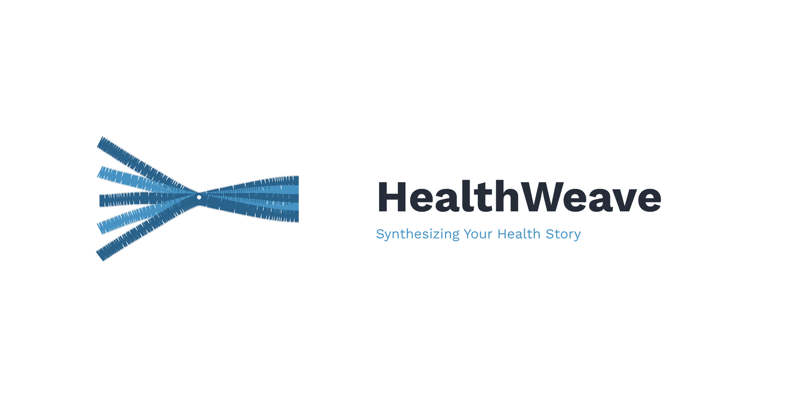

# HealthWeave



AI-Powered Health Data Synthesis & Clinical Insights Platform

## Overview

HealthWeave synthesizes patient health data with current medical literature to generate actionable clinical insights and doctor-ready reports. Built with HIPAA compliance and security as core requirements.

## Architecture

- **Frontend**: Next.js (React + TypeScript)
- **Backend**: Node.js + TypeScript
- **Infrastructure**: AWS (Bedrock, S3, Cognito, DynamoDB, Lambda)
- **AI**: Claude via AWS Bedrock (HIPAA-compliant with BAA)
- **Local Development**: LocalStack for AWS emulation

## Project Structure

```bash  
healthweave/
├── backend/          # Backend API
│   ├── dist          # Compiled code (production)
│   ├── node_modules  # Dependencies
│   └── src           # Source code
├── docs              # Documentation
├── frontend          # Frontend application
│   ├── node_modules  # Dependencies
│   └── src           # Source code
├── Liver Tests       # Liver Tests
├── localstack-data   # LocalStack data
├── logo              # Logo files
└── wiki              # Wiki
```

## Quick Start

### Prerequisites

- Node.js 18+
- Docker & Docker Compose
- AWS CLI (for production deployment)

### Local Development

1. **Start LocalStack**

   ```bash
   docker-compose up -d
   ```

2. **Install Dependencies**

   ```bash
   # Backend
   cd backend && npm install
   
   # Frontend
   cd ../frontend && npm install
   ```

3. **Start Development Servers**

   ```bash
   # Terminal 1 - Backend
   cd backend && npm run dev
   
   # Terminal 2 - Frontend
   cd frontend && npm run dev
   ```

4. **Access Application**
   - Frontend: http://localhost:3000
   - Backend API: http://localhost:4000
   - LocalStack: http://localhost:4566

## Environment Configuration

### Development (LocalStack)

Uses local AWS emulation with Ollama models

### Production (AWS)

Uses real AWS Bedrock with Claude and HIPAA compliance

## Security & Compliance

- HIPAA-compliant architecture
- End-to-end encryption
- Audit logging
- Zero data retention with AI provider
- AWS Bedrock BAA required for production

## Documentation

- [Architecture](./docs/ARCHITECTURE.md)
- [Development Guide](./docs/DEVELOPMENT.md)
- [Deployment Guide](./docs/DEPLOYMENT.md)
- [Compliance](./docs/COMPLIANCE.md)

## License

Proprietary - All Rights Reserved
