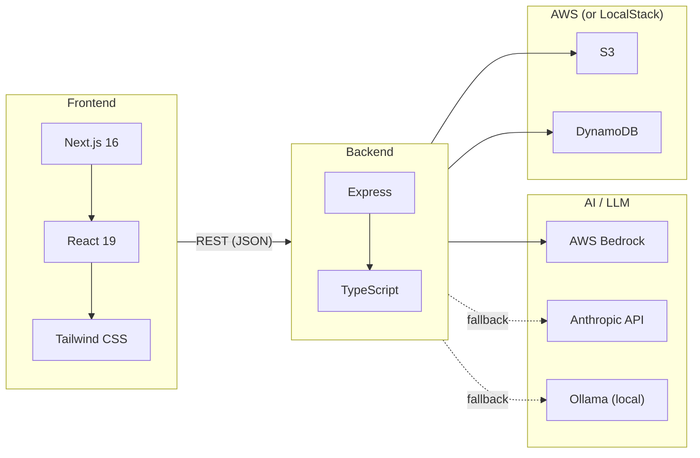
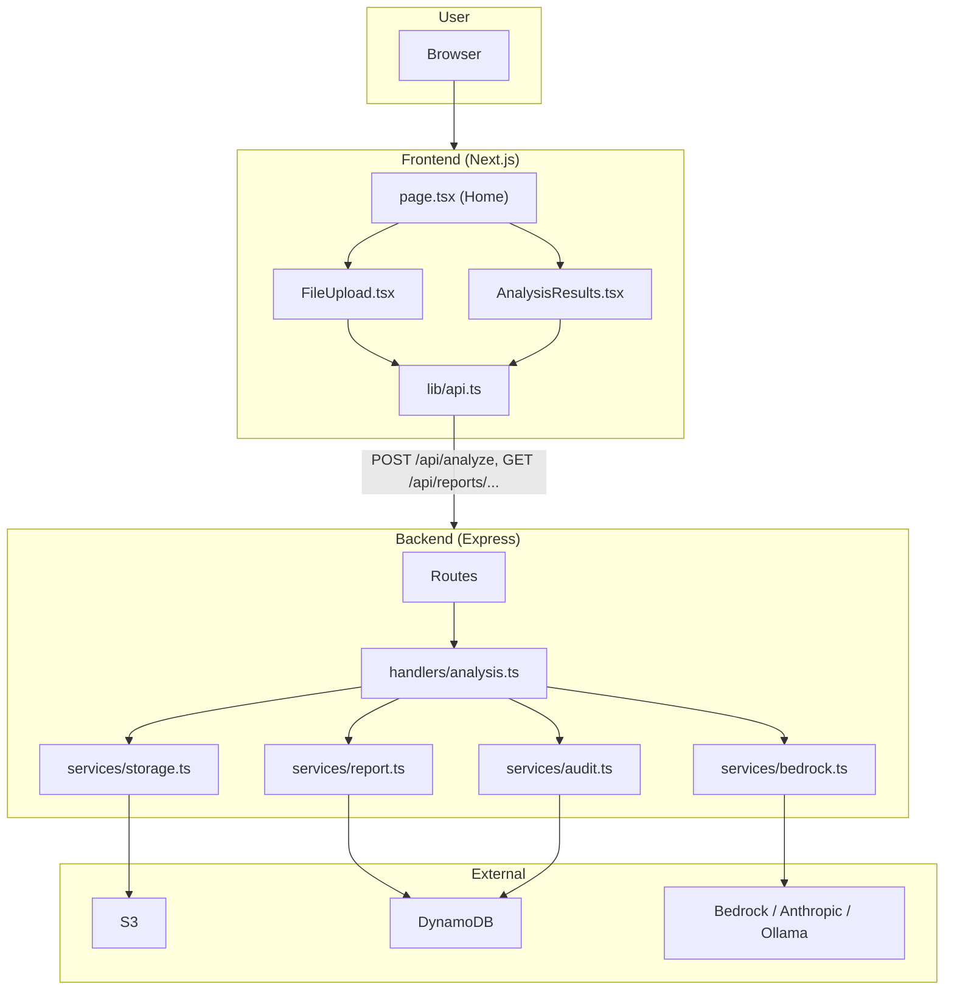

# 01 – HealthWeave Overview

## What HealthWeave Is

HealthWeave is an **AI-powered health data synthesis** application. Users upload medical documents (labs, imaging reports, clinical notes, PDFs, images). The system:

1. Stores documents in object storage (S3).
2. Extracts text from documents (PDF via pdfjs-dist; images placeholder until Textract).
3. Sends document text + optional patient context to an LLM (AWS Bedrock, or Anthropic API / Ollama fallback).
4. Parses the LLM’s markdown response into structured sections (summary, key findings, recommendations, etc.).
5. Saves the report in DynamoDB and returns it to the client.
6. Serves PDF download on demand (generated from the stored report).

All actions are audit-logged (DynamoDB). There is no user authentication yet (userId defaults to `test-user`).

---

## Tech Stack

- **Frontend**: Next.js 16, React 19, Tailwind. Single main page: upload (FileUpload) → results (AnalysisResults). Calls backend via `api.analyzeDocuments`, `api.downloadReportPDF`, etc.
- **Backend**: Express, TypeScript. Handlers: `analyzeDocuments`, `getReport`, `getUserReports`, `downloadReportPDF`. Services: storage (S3 + text extraction), bedrock (LLM), report (DynamoDB + PDF), audit (DynamoDB).
- **AI**: Primary = AWS Bedrock (configurable model). Fallback 1 = Anthropic API (if `ANTHROPIC_API_KEY` set). Fallback 2 = Ollama local (e.g. `mistral:latest`) when Bedrock unavailable (e.g. LocalStack).
- **Storage**: S3 for document blobs; DynamoDB for reports and audit logs. LocalStack used in dev for AWS emulation.

---

## High-Level Architecture

---

## Main Flows (Summary)

| Flow                  | Trigger                               | Path                                                                                    | Outcome                                                                             |
| --------------------- | ------------------------------------- | --------------------------------------------------------------------------------------- | ----------------------------------------------------------------------------------- |
| **Analyze documents** | User submits files + optional context | POST /api/analyze → upload to S3 → extract text → Bedrock → parse → save report → audit | 201 + reportId, summary, keyFindings, recommendations, timing                       |
| **View report**       | User opens result (or later: list)    | GET /api/reports/:reportId (body: userId)                                               | Full report JSON (id, summary, keyFindings, recommendations, fullReport, createdAt) |
| **List reports**      | User (or UI) requests list            | GET /api/reports?limit=50 (body: userId)                                                | Array of reports for userId                                                         |
| **Download PDF**      | User clicks download                  | GET /api/reports/:reportId/pdf?userId=...                                               | PDF binary (attachment)                                                             |

All diagram files in this folder expand these flows in detail.
