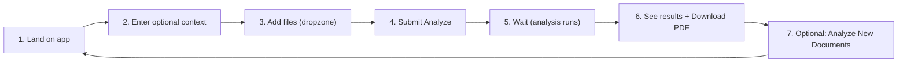
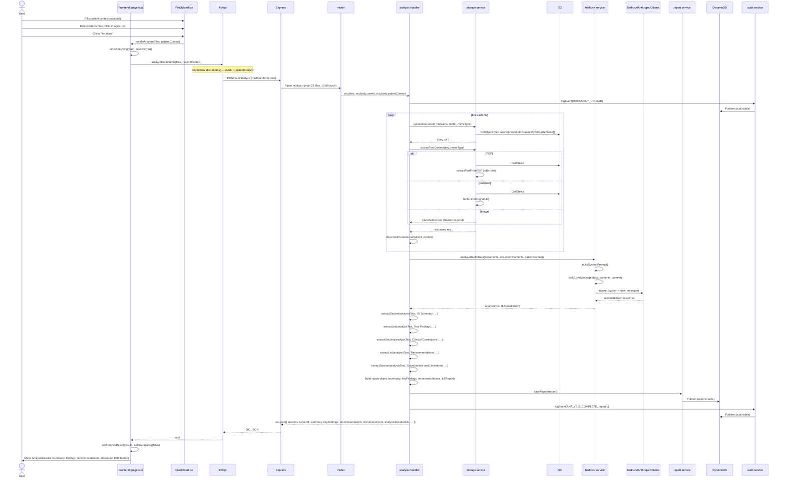
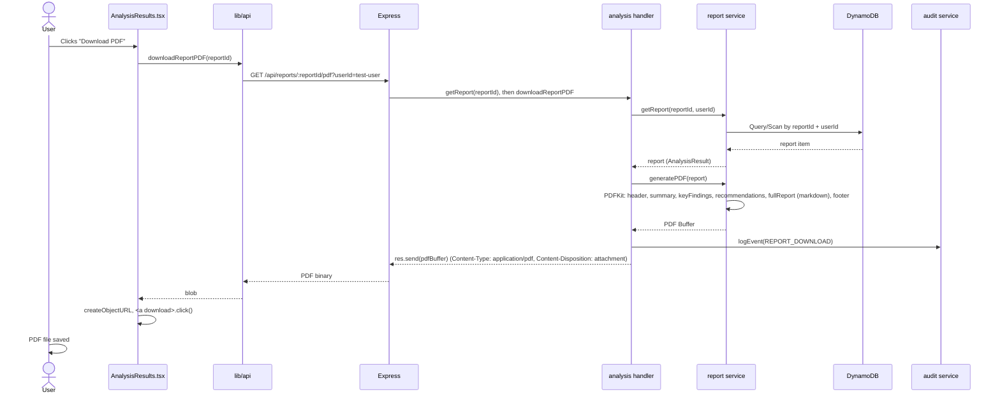
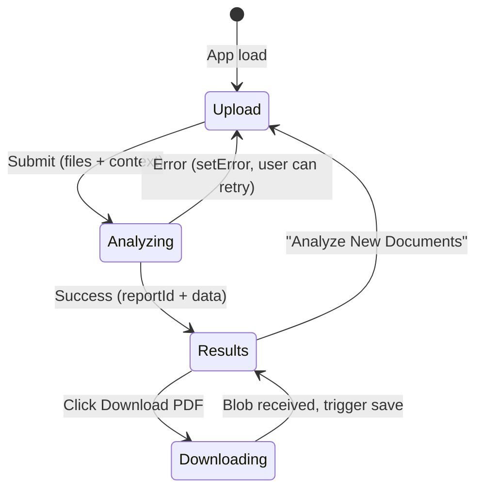

# 02 – User Flow (End-to-End)

This diagram describes the **end-to-end user journey** from opening the app to viewing results and downloading the PDF. It is tailored for AI to understand the logical order of UI and API actions.

---

## User Journey Overview

---

## Detailed Sequence: Analyze Documents

---

## Sequence: Download PDF

---

## UI State Flow

---

## File and Request Constraints (for AI)

- **Allowed file types**: `application/pdf`, `image/jpeg`, `image/png`, `text/plain`, `application/json`.
- **Limits**: 25 files per request, 10MB per file (multer + frontend dropzone).
- **Request body (POST /api/analyze)**: `multipart/form-data` with `documents` (files), `userId` (optional, default test-user), `patientContext` (optional string).
- **Response (success)**: `success: true`, `reportId`, `summary`, `keyFindings`, `recommendations`, `documentCount`, `analysisDurationMs`, `analysisDurationFormatted`, `model` (e.g. mistral:latest when Ollama used).
