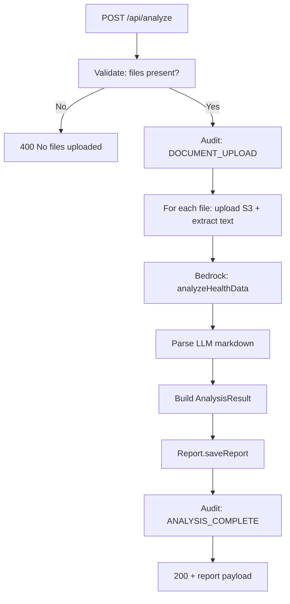
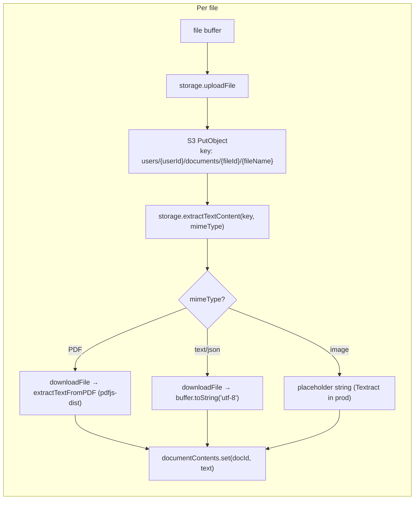
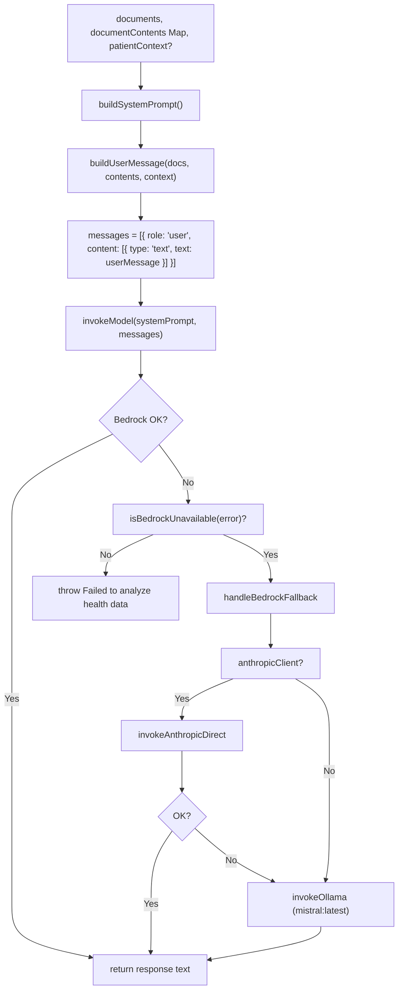
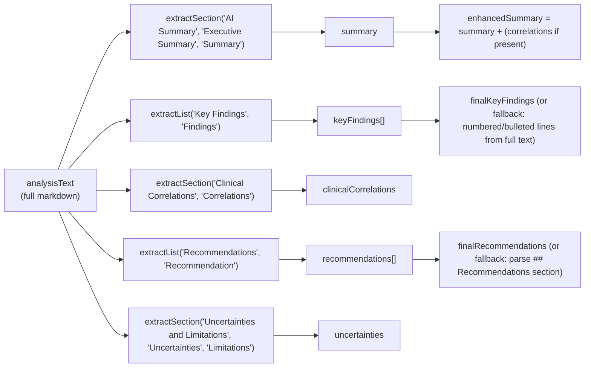
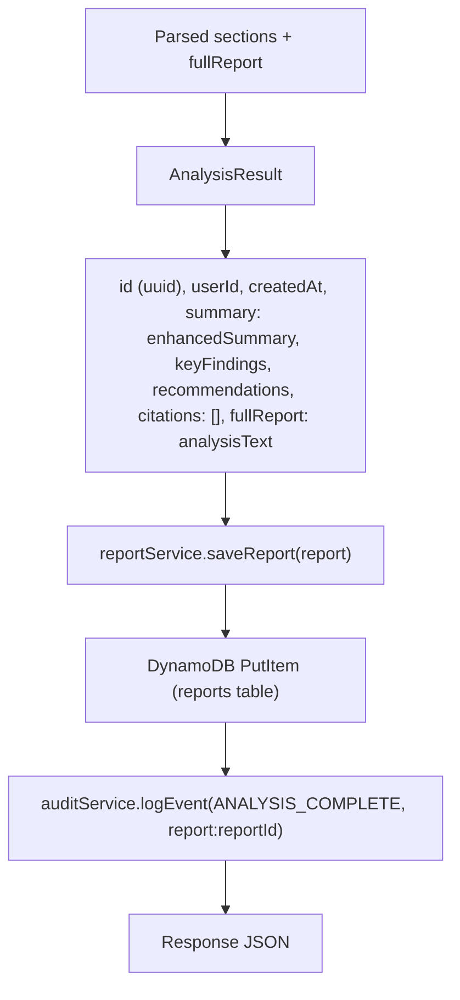

# 03 – Analysis Pipeline (Detailed)

This document describes the **analysis pipeline** from the moment the backend receives POST /api/analyze until the report is saved and the response is sent. It is the single place to understand ordering, error handling, and parsing logic.

---

## Pipeline Stages

---

## Stage 1: Upload and Extract (per file)

- **HealthDocument** created per file: `id` (uuid), `fileName`, `fileType`, `uploadedAt`, `s3Key`, `size`. No document ID is the S3 fileId; docId is generated in handler and used only to key `documentContents` and in the user message.
- **Extract failure**: On exception, handler sets `documentContents.set(docId, '[Content extraction failed for {fileName}]')` and continues.

---

## Stage 2: AI Analysis (Bedrock Service)

- **System prompt**: Defines role (expert clinical analyst), citation requirements, reference-range rules (only flag abnormal when value outside stated range), depth/comprehensiveness, response structure (## AI Summary, ## Key Findings, ## Clinical Correlations, ## Recommendations, ## Uncertainties and Limitations, ## References).
- **User message**: Patient context (if provided) + per-document block "--- Document N: filename ---", "Type: {Laboratory Results|Imaging Study|...}", "Content: {extracted text}". Document type is inferred from filename and content (e.g. lab, imaging, pathology, clinical note, genetic, cardiology).
- **Fallback order**: Bedrock → Anthropic API (if ANTHROPIC_API_KEY) → Ollama (http://localhost:11434/api/chat, model mistral:latest, 10 min timeout).

---

## Stage 3: Parse LLM Response

The LLM returns a single markdown string. The handler parses it into sections using helper functions. **Order of extraction matters** only for which header variant is tried first.

- **extractSection(text, ...headers)**: Tries `## Header`, `**Header**:`, `Header:` and returns content until next section or end.
- **extractList(text, ...headers)**: Gets section first; then extracts items by `**Label:** content`, then `1. item`, then `-`/`*`/`•` items. Returns string array.
- **Fallbacks**: If keyFindings length 0, use first 10 numbered or bulleted lines from full text. If recommendations length 0, find `## Recommendations` and parse numbered/bulleted lines.
- **Default strings**: If no summary, use first 2000 chars of analysisText or "Analysis complete". If no findings, use `['Analysis completed. Review full report for details.']`. If no recommendations, use `['Review the full analysis report with your healthcare provider.']`.

---

## Stage 4: Build and Save Report

- **AnalysisResult** type: `id`, `userId`, `createdAt`, `summary`, `keyFindings`, `recommendations`, `citations` (currently empty array), `fullReport`. Stored in DynamoDB with `createdAt` as number (epoch ms) for range key.
- **Response** includes: `success`, `reportId`, `summary`, `keyFindings`, `recommendations`, `documentCount`, `analysisDurationMs`, `analysisDurationSeconds`, `analysisDurationFormatted`, `model`.

---

## Error Handling (Pipeline)

- **No files**: 400, `{ success: false, error: 'No files uploaded' }`.
- **Multer (e.g. file type/size)**: Error propagates to Express error middleware → 500.
- **Storage/upload failure**: Throws → 500, audit not rolled back (DOCUMENT_UPLOAD already logged).
- **Extract failure per file**: Logged; placeholder text stored; pipeline continues.
- **Bedrock/fallback failure**: Throws → 500, `Failed to analyze health data`.
- **Report save failure**: Throws → 500.
- **Audit failure**: Logged but not thrown (audit must not break main flow).
