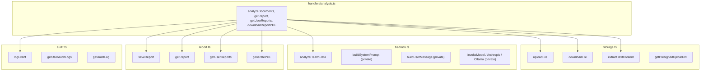
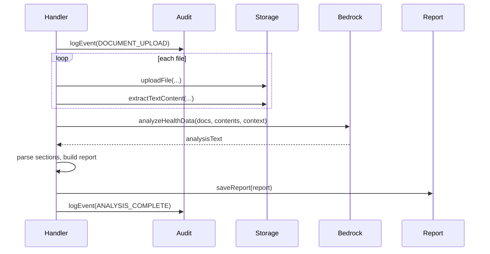

# 04 – Backend Services

This document describes the four main **backend services**, their responsibilities, and how the analysis handler uses them. All services are singletons (default export) and live under `backend/src/services/`.

---

## Service Overview

---

## Storage Service

**Purpose**: Store document blobs in S3 and extract text for analysis.

| Method                                               | Input                       | Output               | Notes                                                                                                                                         |
| ---------------------------------------------------- | --------------------------- | -------------------- | --------------------------------------------------------------------------------------------------------------------------------------------- |
| `uploadFile(userId, fileName, fileBuffer, mimeType)` | User id, name, buffer, type | `{ key, url }`       | Key: `users/{userId}/documents/{fileId}/{fileName}`. Creates bucket if LocalStack. Encryption: AES256 (dev) / aws:kms (prod).                 |
| `downloadFile(key)`                                  | S3 key                      | `Buffer`             | GetObject, stream → buffer.                                                                                                                   |
| `extractTextContent(key, mimeType)`                  | S3 key, MIME type           | `string`             | PDF: download + pdfjs-dist page-by-page text extraction + cleanup. Text/json: download + utf-8 decode. Image: placeholder (Textract in prod). |
| `getPresignedUploadUrl(userId, fileName, mimeType)`  | User, name, type            | `{ uploadUrl, key }` | Presigned PutObject, 1h expiry. Not used by current analyze flow (upload is server-side via multer).                                          |

**Config**: `config.s3.bucketName`, `config.s3.bucketRegion`, `config.aws.endpoint` (LocalStack), `config.env` (encryption).

**Initialization**: If `config.aws.endpoint` set, calls `initializeBucket()` (HeadBucket / CreateBucket).

---

## Bedrock Service

**Purpose**: Run LLM analysis on document contents + optional patient context. Single public method: `analyzeHealthData(documents, documentContents, patientContext)` → raw markdown string.

**Internal flow** (see [05-bedrock-ai-flow.md](05-bedrock-ai-flow.md)):

- `buildSystemPrompt()`: Returns long system prompt (citations, reference ranges, depth, response structure).
- `buildUserMessage(documents, documentContents, patientContext)`: Builds user message with document type per file and full extracted text.
- `invokeModel(systemPrompt, messages)`: Calls AWS Bedrock (model from config).
- On Bedrock failure (e.g. LocalStack 501): `handleBedrockFallback` → Anthropic direct (if API key) → Ollama `mistral:latest`.

**Config**: `config.aws.region`, `config.aws.endpoint`, `config.bedrock.modelId`, env `ANTHROPIC_API_KEY`.

---

## Report Service

**Purpose**: Persist reports in DynamoDB and generate PDFs.

| Method                          | Input                       | Output                 | Notes                                                                                                                                                             |
| ------------------------------- | --------------------------- | ---------------------- | ----------------------------------------------------------------------------------------------------------------------------------------------------------------- |
| `saveReport(report)`            | AnalysisResult              | void                   | PutItem to reports table. `createdAt` stored as number (epoch ms).                                                                                                |
| `getReport(reportId, userId)`   | Report id, user id          | AnalysisResult \| null | Query UserIdIndex + FilterExpression id; fallback Scan by id then filter userId (LocalStack GSI lag).                                                             |
| `getUserReports(userId, limit)` | User id, limit (default 50) | AnalysisResult[]       | Query UserIdIndex, ScanIndexForward: false.                                                                                                                       |
| `generatePDF(report)`           | AnalysisResult              | Promise\<Buffer\>      | PDFKit: title, report id, date, AI Summary, Key Findings, Recommendations, Detailed Analysis (fullReport as markdown via renderMarkdownToPDF), footer disclaimer. |

**DynamoDB**: Table name from `config.dynamodb.reportsTable`. PK: `id`, SK: `createdAt`. GSI: UserIdIndex (userId PK, createdAt SK). LocalStack: table created on first use if missing.

**PDF**: Uses `marked` for markdown → tokens; custom renderer for headings, paragraphs, lists, bold, citations. Strip/clean problematic chars for PDFKit.

---

## Audit Service

**Purpose**: Append-only audit log for HIPAA/compliance. Does not throw on failure (logs only).

| Method                                                            | Input                                                  | Output           | Notes                                                                                                           |
| ----------------------------------------------------------------- | ------------------------------------------------------ | ---------------- | --------------------------------------------------------------------------------------------------------------- |
| `logEvent(userId, action, resource, success, details?, request?)` | User, action, resource, success, optional details, req | void             | PutItem to audit table. Stores id, timestamp, userId, action, resource, ipAddress, userAgent, success, details. |
| `getUserAuditLogs(userId, startDate?, endDate?, limit)`           | User, optional range, limit                            | AuditLog[]       | Query UserIdIndex.                                                                                              |
| `getAuditLog(id, timestamp)`                                      | Id, timestamp                                          | AuditLog \| null | GetItem.                                                                                                        |

**Actions used by handler**: `DOCUMENT_UPLOAD`, `ANALYSIS_COMPLETE`, `REPORT_VIEW`, `REPORTS_LIST`, `REPORT_DOWNLOAD`, `ANALYSIS_FAILED`.

**Config**: `config.dynamodb.auditTable`. Table created on first use if LocalStack.

---

## Call Flow (Analyze Only)

