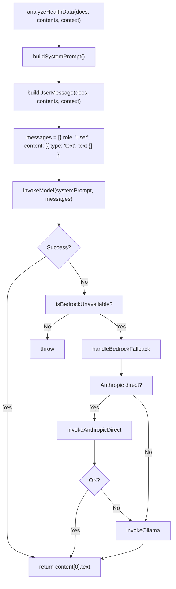

# 05 – Bedrock / AI Flow

This document describes how the **AI analysis** works: system prompt, user message, model invocation, and fallback chain. It gives AI agents enough context to reason about prompt changes and model behavior.

---

## Entry Point

**Single public method**: `bedrockService.analyzeHealthData(documents, documentContents, patientContext?)`

- **Input**: `documents`: HealthDocument[] (id, fileName, fileType, s3Key, etc.); `documentContents`: Map\<docId, string\> (extracted text); `patientContext`: optional string.
- **Output**: Raw markdown string (full analysis). Caller (handler) is responsible for parsing into sections.

---

## High-Level AI Flow

---

## System Prompt (Structure)

The system prompt is a single long string. **Order of sections** (conceptual):

1. **Role**: Expert clinical analyst, multi-specialty; synthesize health documents into actionable insights.
2. **Citation requirements (mandatory)**: Every clinical claim must cite sources. Formats: ClinVar, OMIM, PMID, PharmGKB, CPIC, ACMG, NCCN, AHA, AASLD, etc. Acceptable vs unacceptable sources listed.
3. **Reference range interpretation (mandatory)**: Only flag lab/imaging values as abnormal when they fall **outside** the stated reference range. Values within range must not be labeled elevated/low/abnormal. Rule applies to labeling only—does not reduce depth of analysis.
4. **Depth and comprehensiveness (mandatory)**: Key Findings must have sub-bullets with specific values, ranges, citations; not just category headers. Recommendations must be full sentences with rationale and citations, not just "Immediate Actions" labels. Cover all document types.
5. **Core responsibilities**: Clinical synthesis, pattern recognition, risk stratification, evidence-based recommendations, specialist-level analysis.
6. **Clinical analysis framework**: Data integration, clinical interpretation, risk assessment, specialty-specific considerations (cardiology, hepatology, oncology, hematology, etc.).
7. **Communication principles**: For specialists; clinical documentation standards.
8. **Quality standards**: Accuracy (only cite from documents; reference-range rule; no hallucination), safety, clinical relevance.
9. **Response structure**: Exact markdown sections required—## AI Summary, ## Key Findings (with example format), ## Clinical Correlations, ## Recommendations (with example), ## Uncertainties and Limitations, ## References. Key Findings and Recommendations explicitly required to be detailed.
10. **Critical reminders**: Clinical decision support only; citations mandatory; check value vs reference range before labeling abnormal; output full depth.

**Implementation**: `buildSystemPrompt()` in `backend/src/services/bedrock.ts` returns this string (template literal).

---

## User Message (Structure)

- Opening line: "Please analyze the following patient health documents and provide a comprehensive clinical analysis:"
- If `patientContext`: "**PATIENT CONTEXT:**" + context + "Please integrate this clinical context when interpreting findings."
- "**MEDICAL DOCUMENTS FOR ANALYSIS:**" then for each document:
  - "--- Document N: {fileName} ---"
  - "Type: {Laboratory Results | Imaging Study | Pathology Report | Clinical Note | Genetic Test Report | Cardiology Study | Clinical Document}"
  - "Content:\n{content from documentContents.get(doc.id)}"
- **Document type** is inferred by `identifyDocumentType(fileName, content)` from filename and first 1000 chars (e.g. lab, cbc, imaging, ultrasound, ct, mri, pathology, genetic, ecg, echo).
- Closing block: "**ANALYSIS REQUIREMENTS:**" with numbered instructions (summary, key findings with detail, correlations, recommendations with detail, uncertainties, important notes) and "Provide a COMPREHENSIVE, DETAILED analysis... Please begin your analysis:".

---

## Invoke: Bedrock

- **Model**: `config.bedrock.modelId` (e.g. Claude model ID in prod, or mistral for LocalStack).
- **Request body**: `max_tokens: 4096`, `messages`, and for Claude-style models `anthropic_version: 'bedrock-2023-05-31'`, `system: systemPrompt`. For non-Claude (e.g. Mistral), system prompt is prepended to the first user message.
- **Response**: `response.body` JSON; extract `content[0].text`. On missing content, throw.

---

## Fallback: Anthropic Direct

- **When**: Bedrock fails and `anthropicClient` is set (env `ANTHROPIC_API_KEY`).
- **Model**: `claude-3-5-sonnet-20241022`, `max_tokens: 4096`, same system and messages (content flattened to string per message).
- **Response**: `response.content` filter type `text`, join.

---

## Fallback: Ollama

- **When**: Bedrock fails (and Anthropic if tried also failed). Used when LocalStack does not emulate Bedrock.
- **Endpoint**: `POST http://localhost:11434/api/chat`.
- **Body**: `model: 'mistral:latest'`, `messages: [{ role: 'system', content: systemPrompt }, { role: 'user', content: userMessage }]`, `stream: false`, `options: { temperature: 0.3, top_p: 0.9, num_ctx: 32768 }`.
- **Timeout**: 10 minutes (AbortController). On timeout/connection error, throws with user-friendly message.
- **Response**: `data.message?.content || data.response || data.text`.

---

## Bedrock “Unavailable” Detection

`isBedrockUnavailable(error)` is true when **all** of:

- `config.aws.endpoint` is set (LocalStack), and
- One of: `error.name === 'InternalFailure'`, `error.$metadata?.httpStatusCode === 501`, `error.__type === 'InternalFailure'`, or message includes `'bedrock-runtime'` / `'not yet been emulated'`.

Otherwise the error is rethrown (no fallback).

---

## Summary for AI Agents

- **Prompt location**: `backend/src/services/bedrock.ts` — `buildSystemPrompt()`, `buildUserMessage()`.
- **Reference-range rule**: Only flag values as abnormal when outside document’s stated range; still require full depth (sub-bullets, full recommendation sentences).
- **Output**: One markdown string. Handler parses with `extractSection` / `extractList` for ## AI Summary, Key Findings, Clinical Correlations, Recommendations, Uncertainties and Limitations.
- **Model chain**: Bedrock → Anthropic API → Ollama. No retries; first success returns.
