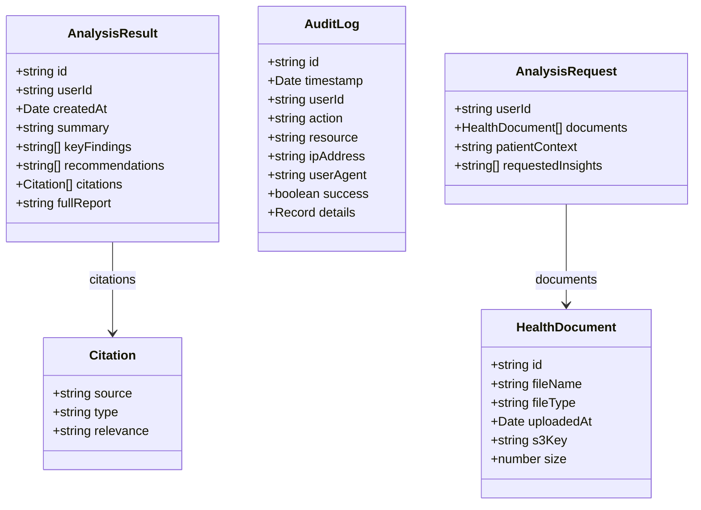

# 06 – Data Model

This document describes the **core types and storage shape** used across the application. It allows AI to reason about request/response shapes and persistence without reading type definitions line-by-line.

---

## Core Types (TypeScript)

---

## HealthDocument

- **Where**: Created in handler per uploaded file; not stored as a standalone table. Stored implicitly via S3 key and in memory for the request.
- **id**: UUID generated in handler; used to key `documentContents` and in user message (Document 1, 2, …).
- **fileName**, **fileType**: Original name and MIME type from upload.
- **uploadedAt**: New Date() at upload time.
- **s3Key**: From storage.uploadFile: `users/{userId}/documents/{fileId}/{fileName}`.
- **size**: File size in bytes.

---

## AnalysisResult

- **Where**: Stored in DynamoDB (reports table); returned by GET /api/reports/:reportId and GET /api/reports; input to generatePDF.
- **id**: UUID; primary key for report.
- **userId**: Partition for user-scoped access; default `test-user` until auth.
- **createdAt**: Stored as number (epoch ms) in DynamoDB for range key / sorting.
- **summary**: Enhanced summary (may include clinical correlations); shown in UI and PDF.
- **keyFindings**: Array of strings (each may contain markdown, e.g. **Label:** content).
- **recommendations**: Array of strings.
- **citations**: Array of Citation; currently always [] (TODO extract from analysis).
- **fullReport**: Raw markdown from LLM; used for Detailed Analysis section in PDF and for re-parsing if needed.

---

## Citation (stub)

- **source**, **type** ('document' | 'research' | 'clinical_guideline'), **relevance**. Not yet populated by parser.

---

## AuditLog

- **Where**: DynamoDB audit table. Written by auditService.logEvent; read by getUserAuditLogs / getAuditLog.
- **id**, **timestamp** (stored as number in DDB), **userId**, **action**, **resource**, **ipAddress**, **userAgent**, **success**, **details** (optional object).
- **Actions** used: DOCUMENT_UPLOAD, ANALYSIS_COMPLETE, ANALYSIS_FAILED, REPORT_VIEW, REPORTS_LIST, REPORT_DOWNLOAD.

---

## Config (runtime)

- **env**, **port**, **host**: Node env, server port, bind host.
- **aws**: **region**, **endpoint** (optional, for LocalStack).
- **bedrock**: **modelId** (e.g. Claude or mistral).
- **s3**: **bucketName**, **bucketRegion**.
- **dynamodb**: **reportsTable**, **auditTable**.
- **cognito**: optional **userPoolId**, **clientId** (for future auth).
- **security**: **jwtSecret**, **encryptionKey**.
- **cors**: **origin**.
- **logging**: **level**.

---

## DynamoDB Table Layouts

**Reports table**

- **PK**: id (string)
- **SK**: createdAt (number, epoch ms)
- **GSI**: UserIdIndex — PK: userId, SK: createdAt (most recent first for list).
- **Items**: AnalysisResult with createdAt serialized as number.

**Audit table**

- **PK**: id (string)
- **SK**: timestamp (number)
- **GSI**: UserIdIndex — PK: userId, SK: timestamp.
- **Items**: AuditLog with timestamp as number.

---

## Request/Response Shapes (analysis only)

**POST /api/analyze (request)**

- Content-Type: multipart/form-data.
- Fields: `documents` (file[]), `userId` (optional), `patientContext` (optional).

**POST /api/analyze (response 200)**

- success: true
- reportId: string
- summary: string
- keyFindings: string[]
- recommendations: string[]
- documentCount: number
- analysisDurationMs: number
- analysisDurationSeconds: number
- analysisDurationFormatted: string
- model: string (e.g. "mistral:latest")

**GET /api/reports/:reportId (body: userId)**

- Response: { success: true, report: AnalysisResult } or 404.

**GET /api/reports (body: userId, query: limit)**

- Response: { success: true, reports: AnalysisResult[] }.

**GET /api/reports/:reportId/pdf (query: userId)**

- Response: application/pdf binary, attachment filename healthweave-report-{reportId}.pdf.
