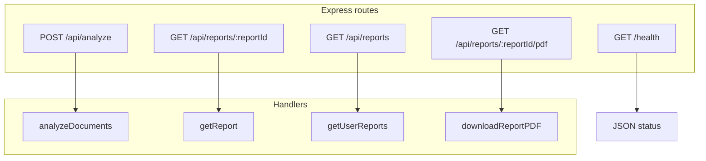
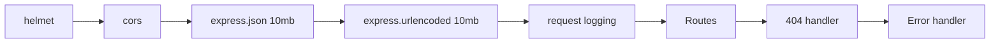
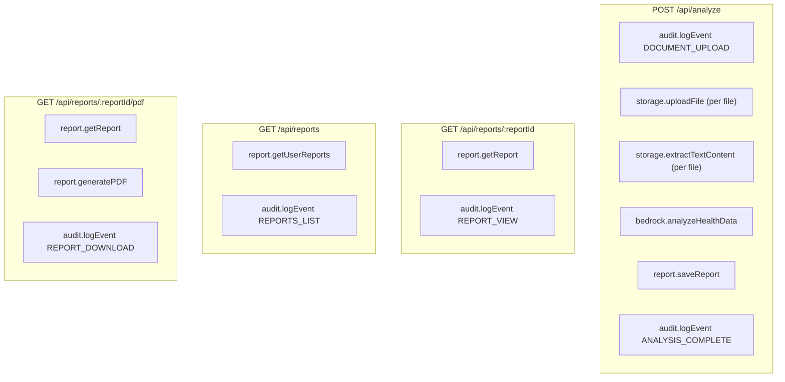

# 07 – API Routes

This document lists all **HTTP routes**, their handlers, and which services they use. It gives AI and humans a complete map of the backend API surface.

---

## Route Map

---

## Route Details

| Method | Path                       | Handler           | Auth                 | Description                                                                                                                                                                                             |
| ------ | -------------------------- | ----------------- | -------------------- | ------------------------------------------------------------------------------------------------------------------------------------------------------------------------------------------------------- |
| GET    | /health                    | (inline)          | No                   | Returns `{ status: 'healthy', timestamp, environment }`.                                                                                                                                                |
| POST   | /api/analyze               | analyzeDocuments  | No (userId in body)  | Multipart upload: documents, userId, patientContext. Uploads to S3, extracts text, runs AI, parses response, saves report, audits. Returns reportId + summary + keyFindings + recommendations + timing. |
| GET    | /api/reports/:reportId     | getReport         | No (userId in body)  | Body: userId. Returns full report JSON or 404. Logs REPORT_VIEW.                                                                                                                                        |
| GET    | /api/reports               | getUserReports    | No (userId in body)  | Body/usage: userId. Query: limit (default 50). Returns list of reports for user (most recent first). Logs REPORTS_LIST.                                                                                 |
| GET    | /api/reports/:reportId/pdf | downloadReportPDF | No (userId in query) | Query: userId. Fetches report, generates PDF, returns attachment. Logs REPORT_DOWNLOAD.                                                                                                                 |

**Note**: All report routes currently use `userId = 'test-user'` when not supplied (TODO: JWT/auth).

---

## Middleware Order (Express)

- **helmet**: Security headers.
- **cors**: Origin check (development allows localhost/private IPs; production uses allowed list). Methods: GET, POST, PUT, DELETE, OPTIONS. Allowed headers: Content-Type, Authorization. Credentials: true.
- **Body limits**: 10mb for JSON and urlencoded (needed for large context; actual file upload is multipart via multer in analyzeDocuments, 10MB per file, max 25 files).

---

## Service Usage by Route

---

## Error Responses

- **400**: No files uploaded (POST /api/analyze).
- **404**: Report not found (GET report or GET pdf).
- **500**: Any thrown error in handler or service (e.g. S3, Bedrock, DynamoDB, PDF generation). Message in body only in development (config.env === 'development').
- **CORS error**: Origin not allowed → response may be non-2xx; message from CORS callback.

---

## Quick Reference for AI

- **Analyze**: POST /api/analyze, multipart with `documents`, `userId`, `patientContext`. Response includes reportId; use it for GET report and GET pdf.
- **List reports**: GET /api/reports with body/param userId (e.g. test-user). Optional query limit.
- **Single report**: GET /api/reports/:reportId, body userId.
- **PDF**: GET /api/reports/:reportId/pdf?userId=... returns binary PDF; no JSON.
- **Health**: GET /health for liveness/readiness.
